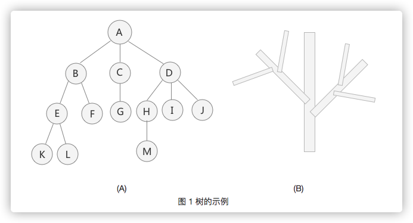

# 树存储结构

数据结构的树存储结构，常用于存储逻辑关系为 "一对多" 的数据。

树存储结构中，最常用的还是二叉树，本章就二叉树的存储结构、二叉树的前序、中序、后序以及层次遍历、线索二叉树、哈夫曼树等，详细介绍二叉树。



## 一、数据结构的树存储结构

树结构是一种非线性存储结构，存储的是具有“一对多”关系的数据元素的集合。
___
### 1. 树的结点
`结点`：使用树结构存储的每一个数据元素都被称为“结点”。

`根结点`：每一个非空树都有且只有一个被称为根的结点。

`叶子结点`：如果结点没有任何子结点，那么此结点称为叶子结点（叶结点）。

`父结点（双亲结点）`：拥有某个子结点的结点。

`子结点（孩子结点）`：属于某个父结点的结点。

`兄弟结点`：它们都有相同的父结点。
___
### 2. 子树和空树
`子树`：如图 1（A）中，整棵树的根结点为结点 A，而如果单看结点 B、E、F、K、L 组成的部分来说，也是棵树，而且结点 B 为这> 棵树的根结点。所以称 B、E、F、K、L 这几个结点组成的树为整棵树的子树；同样，结点 E、K、L 构成的也是一棵子树，根结点为 E。
 
> 注意：单个结点也是一棵树，只不过根结点就是它本身。图 1（A）中，结点 K、L、F 等都是树，且都是整棵树的子树。

`空树`：如果集合本身为空，那么构成的树就被称为空树。空树中没有结点。

> 补充：在树结构中，对于具有同一个根结点的各个子树，相互之间不能有交集。例如，图 1（A）中，除了根结点 A，其余元素又各自构成了三个子树，根结点分别为 B、C、D，这三个子树相互之间没有相同的结点。如果有，就破坏了树的结构，不能算做是一棵树。
___
### 3. 结点的度和层次
`度`：对于一个结点，拥有的子树数（结点有多少分支）称为结点的度（Degree）。例如，图 1（A）中，根结点 A 下分出了 3 个子树，所以，结点 A 的度为 3。

> 一棵树的度是树内各结点的度的最大值。图 1（A）表示的树中，各个结点的度的最大值为 3，所以，整棵树的度的值是 3。

`结点的层次`：从一棵树的树根开始，树根所在层为第一层，根的孩子结点所在的层为第二层，依次类推。对于图 1（A）来说，A 结点在第一层，B、C、D 为第二层，E、F、G、H、I、J 在第三层，K、L、M 在第四层。

> 一棵树的深度（高度）是树中结点所在的最大的层次。图 1（A）树的深度为 4。
___
### 4. 有序树和无序树
如果树中结点的子树从左到右看，谁在左边，谁在右边，是有规定的，这棵树称为有序树；反之称为无序树。

> 在有序树中，一个结点最左边的子树称为"第一个孩子"，最右边的称为"最后一个孩子"。

拿图 1（A）来说，如果是其本身是一棵有序树，则以结点 B 为根结点的子树为整棵树的第一个孩子，以结点 D 为根结点的子树为整棵树的最后一个孩子。
___
### 5. 森林
`由 m（m >= 0）个互不相交的树组成的集合被称为森林`。图 1（A）中，分别以 B、C、D 为根结点的三棵子树就可以称为森林。

前面讲到，树可以理解为是由根结点和若干子树构成的，而这若干子树本身是一个森林，所以，树还可以理解为是由根结点和森林组成的。用一个式子表示为：
```
Tree =（root,F）
```
其中，root 表示树的根结点，F 表示由 m（m >= 0）棵树组成的森林。
___
### 6. 总结
树型存储结构类似于家族的族谱，各个结点之间也同样可能具有父子、兄弟、表兄弟的关系。本节中，要重点理解树的根结点和子树的定义，同时要会计算树中各个结点的度和层次，以及树的深度。