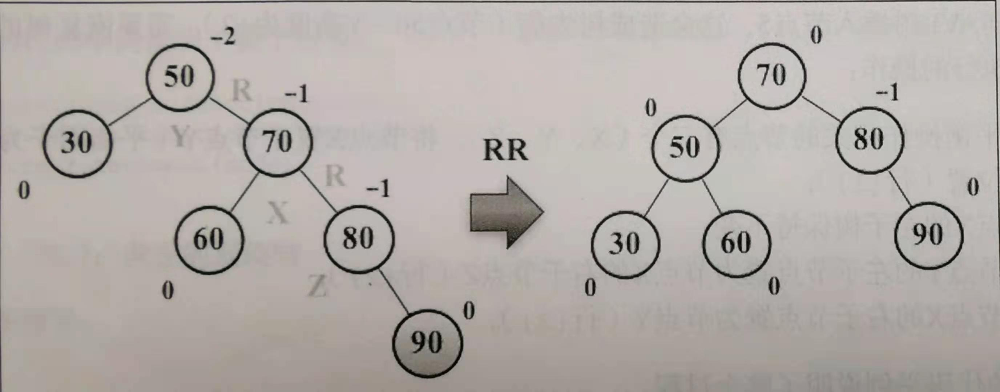
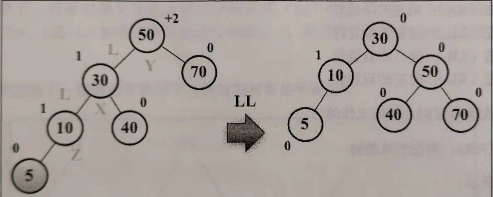
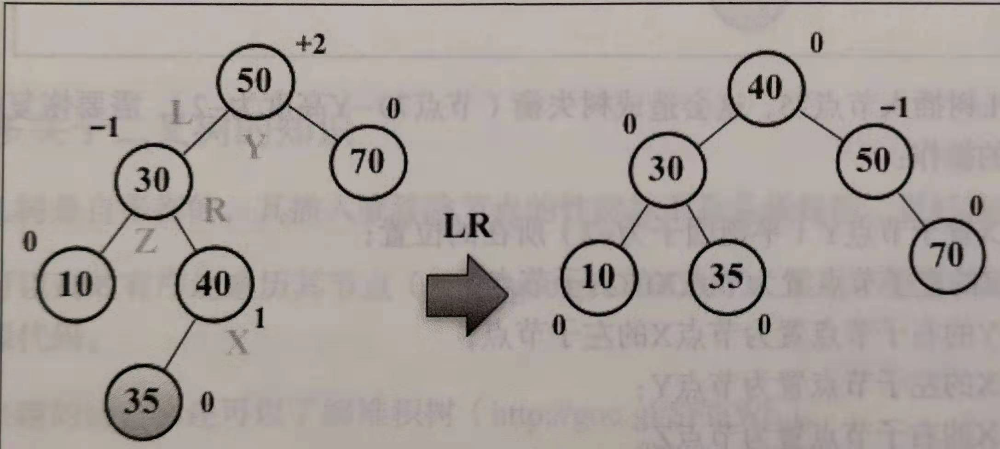
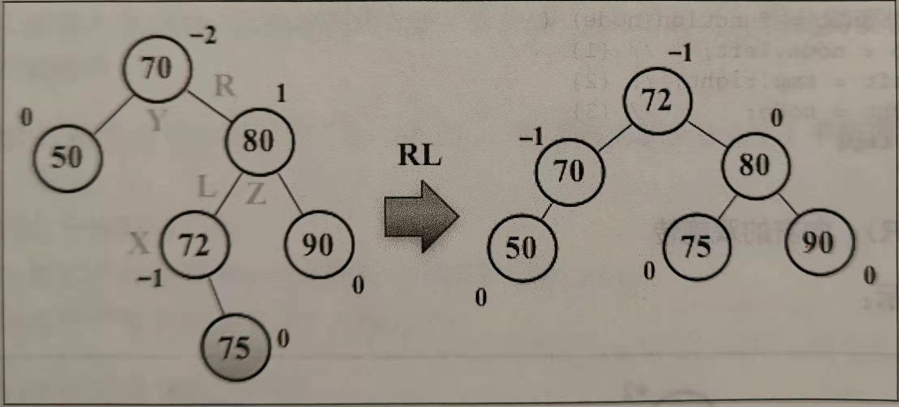
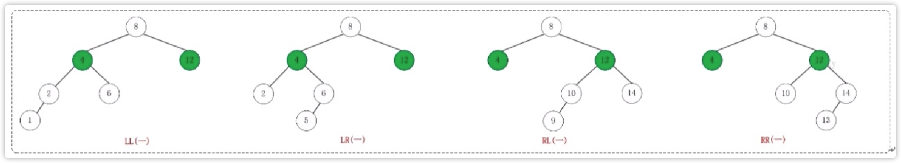
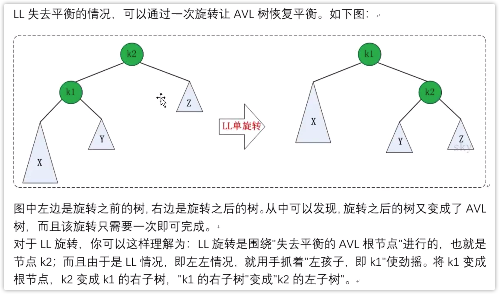
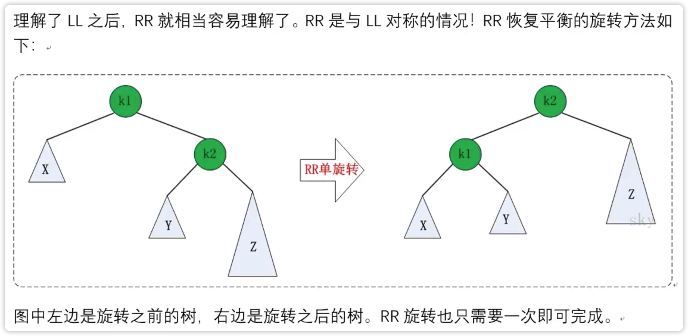

# AVL旋转
向AVL树插入结点时，可以执行单旋转或双旋转两种平衡操作，分别对应四种场景：
1. 右-右（RR）：向左的单旋转
2. 左-左（LL）：向右的单旋转
3. 左-右（LR）：向右的双旋转
4. 右-左（RL）：向左的双旋转

我们依次看看他们是如何工作的。

## 1. 右-右（RR）：向左的单旋转


```javascript
var rotationRR = function(node) {
    let tmp = node.right;
    node.right = tmp.left;
    tmp.left = node;
    return tmp;
}
```

## 2. 左-左（LL）：向右的单旋转


```javascript
var rotationLL = functiion(node) {
    let tmp = node.left;
    node.left = tmp.right;
    tmp.right = node;
    return tmp;
}
```

## 3. 左-右（LR）：向右的双旋转


基本上，就是先做一次RR旋转，再做一次LL旋转。

```javascript
var rotationLR = function(node) {
    node.left = rotationRR(node.left);
    return rotationLL(node);
}
```

## 4. 右-左（RL）：向左的双旋转


基本上，就是先做一次LL旋转，再做一次RR旋转。

```javascript
var rotationRL = function(node) {
    node.right = rotationLL(node.right);
    return ratationRR(node);
}
```

# 四种旋转
如果在AVL树中进行插入或删除节点后，可能导致AVL树失去平衡。这种失去平衡的可以概括为4种情况：LL（左左）、LR（左右）、RR（右右）和RL（右左）。



AVL失去平衡之后，可以通过旋转使其恢复平衡。下面分别介绍这4种情况对应的旋转方法。

## 1. LL的旋转


## 2. RR的旋转
