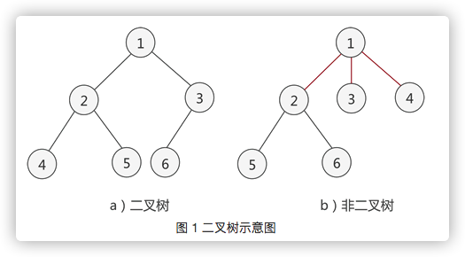
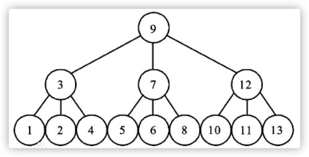

# 二叉树
简单地理解，满足以下两个条件的树就是二叉树：
* 本身是有序树；
* 树中包含的各个节点的度不能超过 2，即只能是 0、1 或者 2；

# 平衡树
平衡树，实际上就是遵循以下特点的树：
* 任意节点的子树的高度差都小于等于1

常见的符合平衡树的有，B树（多路平衡搜索树）、AVL树（二叉平衡搜索树）等。

# 平衡二叉树
平衡二叉树，实际上就是遵循以下两个特点的二叉树：
* `每个结点`的`左子树和右子树`的`深度差不能超过 1`；
* 二叉树中每棵子树都要求是平衡二叉树；

> 其实就是在二叉树的基础上，若树中每棵子树都满足其左子树和右子树的深度差都不超过 1，则这棵二叉树就是平衡二叉树。

`平衡因子`：每个结点都有其各自的平衡因子，表示的就是其左子树深度同右子树深度的差。平衡二叉树中各结点平衡因子的取值只可能是：0、1 和 -1。

> 如图 1 所示，其中 （a） 的两棵二叉树中由于各个结点的平衡因子数的绝对值都不超过 1，所以 （a） 中两棵二叉树都是平衡二叉树；而 （b） 的两棵二叉树中有结点的平衡因子数的绝对值超过 1，所以都不是平衡二叉树。
>
> 其中图1（b）左侧的那个树中的节点2，其左子树深度为3，右子树的深度为1，深度差为2，因此不是平衡二叉树。
>
> 其中图1（b）右侧的那个树中的节点-2，其左子树是个空树，深度为0，右子树的深度为2，深度差为2，因此不是平衡二叉树。

# 平衡二叉搜索树（二叉平衡搜索树）
平衡二叉搜索树，又称AVL树。就是在二叉搜索树的基础上，又加入了平衡二叉树的规则形成的一种树。