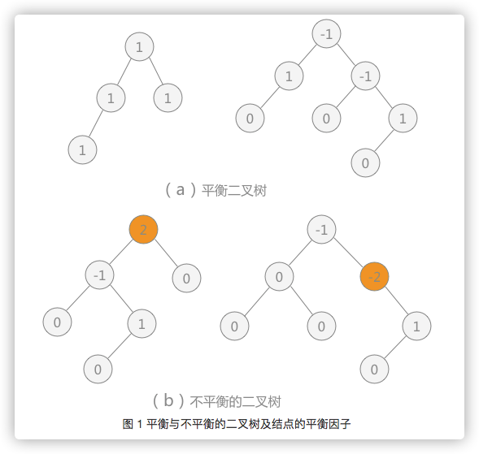

# 二叉树
简单地理解，满足以下两个条件的树就是二叉树：
* 本身是有序树；
* 树中包含的各个结点的度不能超过 2，即只能是 0、1 或者 2；


# 平衡树
平衡树，实际上就是遵循以下特点的树：
* 任意结点的子树的高度差都小于等于1

常见的符合平衡树的有，B树（多路平衡搜索树）、AVL树（二叉平衡搜索树）等。


# 平衡二叉树
平衡二叉树，实际上就是遵循以下两个特点的二叉树：
* `每个结点`的`左子树和右子树`的`深度差不能超过 1`；
* 二叉树中每棵子树都要求是平衡二叉树；

> 其实就是在二叉树的基础上，若树中每棵子树都满足其左子树和右子树的深度差都不超过 1，则这棵二叉树就是平衡二叉树。



`平衡因子`：每个结点都有其各自的平衡因子，表示的就是其左子树深度同右子树深度的差。平衡二叉树中各结点平衡因子的取值只可能是：0、1 和 -1。

> 如图 1 所示，其中 （a） 的两棵二叉树中由于各个结点的平衡因子数的绝对值都不超过 1，所以 （a） 中两棵二叉树都是平衡二叉树；而 （b） 的两棵二叉树中有结点的平衡因子数的绝对值超过 1，所以都不是平衡二叉树。
>
> 其中图1（b）左侧的那个树中的结点2，其左子树深度为3，右子树的深度为1，深度差为2，因此不是平衡二叉树。
>
> 其中图1（b）右侧的那个树中的结点-2，其左子树是个空树，深度为0，右子树的深度为2，深度差为2，因此不是平衡二叉树。

# 平衡二叉搜索树（二叉平衡搜索树、自平衡二叉搜索树）
平衡二叉搜索树，又称AVL树。就是在二叉搜索树的基础上，又加入了平衡二叉树的规则形成的一种树。

`自平衡二叉搜索树`：意思是任何一个结点左右两侧子树的高度之差最多为1，也就是说这种树会在添加或者移除结点时尽量试着成为一棵完全树。

## 1. 平衡因子

在AVL树中插图或者移除结点和BST完全相同。然而，AVL树的不同之处在于我们需要检验它的`平衡因子`，如果有需要，则将其逻辑应用于树的自平衡。

## 2. 如何判断一个树是平衡树？
就是根据每个结点的平衡因子值来计算的，如果每个结点的平衡因子值都是0、1和-1，那么就是平衡树。

## 3. 平衡因子计算
在AVL树中，对每个结点计算右子树高度和左子树高度的差值，该值应为0、1和-1。如果不是这个三个值之一，则需要平衡该AVL树。

代码如下：

```javascript
    // 计算结点高度
    getNodeHeight(node) {
        if (node === null) {
            return -1;// 这个地方既可以返回0，也可以返回-1，就看根结点算第1层结点，还是第0层结点，如果是第0层，则返回-1
        }
        
        return Math.max(this.getNodeHeight(node.left), this.getNodeHeight(node.right)) + 1;
    }

    // 获取平衡因子
    getBalanceFactor(node) {
        let heightDifference = this.getNodeHeight(node.left) - this.getNodeHeight(node.right);// 这就是平衡因子（具体的代码解释在BinaryBalanceSearchTree.js里）

        switch (heightDifference) {
            case -2: return BalanceFactor.UNBALANCED_RIGHT;
            case -1: return BalanceFactor.SLIGHTLY_UNBALANCED_RIGHT;
            case  1: return BalanceFactor.SLIGHTLY_UNBALANCED_LEFT;
            case  2: return BalanceFactor.UNBALANCED_LEFT;
            default: return BalanceFactor.BALANCED;
        }
    }
```

# BST和AVL对比

## 1. BST
`BST的优点`：相较于线性结构查找，提高了查找效率，查询时间复杂度为O(log2N)，此为平均查找时间复杂度。

`BST的缺点`：树不够平衡，即左右树的高度相差可多可少，导致查找的时间复杂度不稳定，最多会到O(N)的时间复杂度。

## 2. AVL
`问题说明`：二叉搜索树提高了树中数据查找的效率，但是也有不足的地方，比如因为树的高度不可控，导致很多场景下会造成查找效率低下。尤其是左斜树或者是右斜树的情况下，时间复杂度是O(N)，而最佳查找时间复杂度是O(log2N)。

`解决办法`：平衡二叉树是通过控制树的平衡性，来解决二叉搜索树的不平衡性导致的查找时间复杂度不稳定的问题。

`缺点`：牺牲了二叉搜索树的插入和删除的性能表现。因为BST在插入和移除的时候，都是找到正确的摆放结点的位置后，直接插入或者移除。但是AVL不一样了，除了要执行插入和移除之外，还要再接着评估树的平衡性，计算各个结点的平衡因子，如果平衡因子绝对值大于1的话，就执行平衡操作。如果对一棵AVL树频繁的插入和移除操作的的话，树的平衡过程就会拖累整个的插入和移除操作，严重降低性能。

`特点`：AVL树中任何结点的两个子树的高度差的绝对值最大为1。